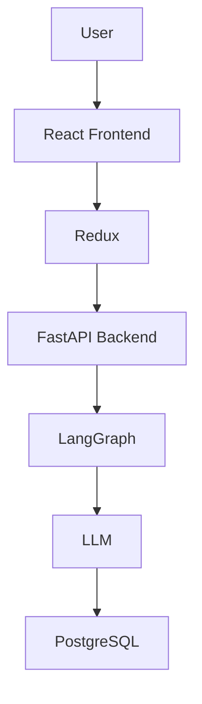

# AI-First CRM

## Project Overview

AI-First CRM is a full-stack web application built for managing interactions with Healthcare Professionals (HCPs). Instead of filling out long forms, users can simply describe a meeting with a doctor in plain English. The AI reads that text and pulls out useful details like the doctor's name, hospital, drug discussed, sentiment, action items, follow-up date, and a short summary.

## Features

- AI Chat Assistant for logging and querying interactions
- AI extracts meeting details from natural language input
- HCP Search to find doctors by name, hospital, or specialty
- Interaction History to view past meetings
- Follow-up Recommendations based on previous interactions
- Responsive UI that works on different screen sizes
- Dashboard with an overview of key activity

## Tech Stack

### Frontend

- React
- TypeScript
- Vite
- Tailwind CSS
- Redux Toolkit
- Framer Motion

### Backend

- FastAPI
- Python
- PostgreSQL
- SQLAlchemy
- Alembic
- LangGraph
- LangChain
- Groq / OpenAI LLM

## Project Structure

```
AI-First-CRM/
├── src/                    # React frontend
│   ├── components/         # Reusable UI and feature components
│   ├── pages/              # Route pages (Dashboard, HCP List, etc.)
│   ├── layouts/            # App layout and navigation
│   ├── redux/              # Redux store and slices
│   ├── services/           # API service calls
│   └── styles/             # Global styles
├── server/                 # FastAPI backend
│   ├── app/
│   │   ├── agents/         # LangGraph agent logic
│   │   ├── ai/             # LLM client and prompts
│   │   ├── models/         # SQLAlchemy database models
│   │   ├── routers/        # API route handlers
│   │   ├── schemas/        # Pydantic request/response schemas
│   │   ├── services/       # Business logic
│   │   └── tools/          # AI tools (search, log, recommend)
│   ├── alembic/            # Database migrations
│   └── requirements.txt
└── package.json
```

## Installation

### Frontend

```bash
npm install
npm run dev
```

The frontend runs at `http://localhost:5173`.

### Backend

```bash
cd server
python -m venv .venv
pip install -r requirements.txt
uvicorn app.main:app --reload
```

The backend runs at `http://localhost:8000`.

Before starting the backend, copy `server/.env.example` to `server/.env` and set your database URL and `GROQ_API_KEY`.

## Architecture



## Future Improvements

- Add user authentication and role-based access
- Support voice input for logging meetings
- Add email reminders for follow-up tasks
- Export interaction reports as PDF
- Improve AI accuracy with more training examples

## Author

**Chinmaya Madhavan**
